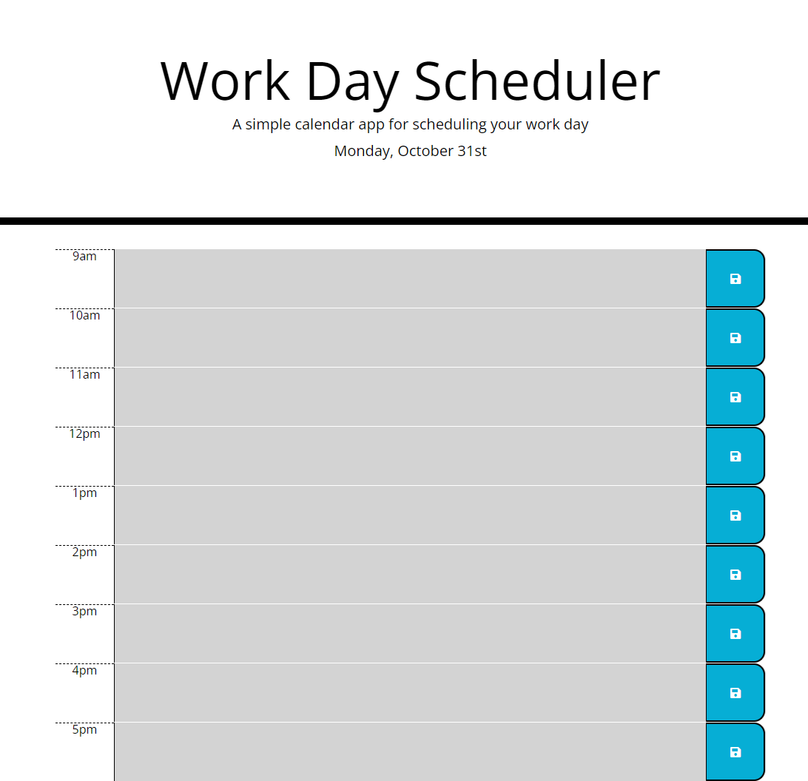

# Daily Planner

This project uses jQuery, Bootstrap, and Moment.js to create a daily planner. The planner is split into hourly categories. Enteries are saved into local storage by pressing the save button to the right of the entry. The site uses Moment.js to evaluate the local time and color codes the enteries based on whether they have passed, are currently happening, or are in the future.

## Installation

N/A

## Usage

[Live website](https://aknoedler.github.io/daily-planner/)

Enter tasks into the hourly sections, then click the save button to save to local storage.

## Screenshots

## Contributing

N/A

## License

N/A